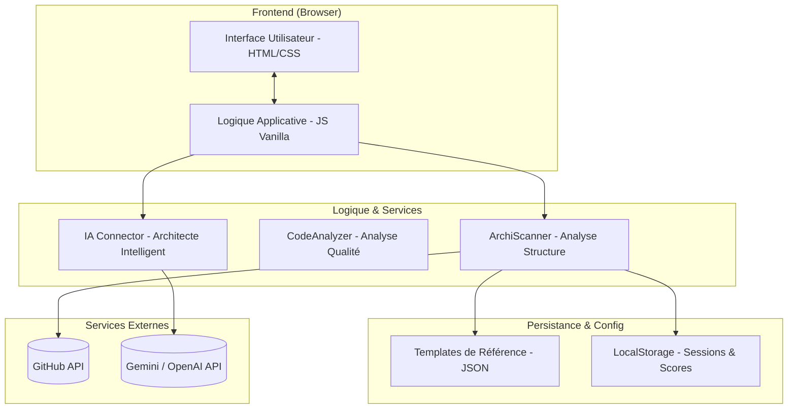

# Architecture Globale - Toolbox-IT

Ce document définit la structure technique de Toolbox-IT, les responsabilités de chaque module et les flux d'interactions pour garantir une application maintenable et évolutive.

## 🏗️ Schéma d'Architecture Globale

## 🧩 Responsabilités des Blocs

### 1. Interface Utilisateur (UI)
- **Responsabilité** : Rendu visuel, capture des entrées utilisateur (URLs GitHub, choix de stack) et affichage des scores/rapports.
- **Technologies** : HTML5, Vanilla CSS (Design Premium).

### 2. Logique Applicative (AppJS)
- **Responsabilité** : Orchestration des services, gestion de l'état global et routage simple (SPA-like).
- **Technologies** : JavaScript (ES6+).

### 3. ArchiScanner (Logic)
- **Responsabilité** : Requêter l'API GitHub pour obtenir l'arborescence des fichiers et la comparer aux `Templates de Référence`.
- **Indicateur de succès** : Précision du matching entre le repo et le template choisi (ex: Dossier `/src`, `/controllers`, etc.).

### 4. IA Architecte (Service)
- **Responsabilité** : Formater les prompts pour l'IA et traiter les suggestions de structure en fonction des besoins de l'étudiant.

### 5. Templates de Référence (Data)
- **Responsabilité** : Stocker les structures idéales pour différents types de projets (Web PHP, Mobile Android, API Node.js).

## 🔄 Flux Principaux

### Flux A : Analyse d'Architecture (Scan)
1. L'utilisateur fournit une URL de dépôt GitHub.
2. Le `AppJS` déclenche le `Scanner`.
3. Le `Scanner` récupère l'arborescence via `GitHub API`.
4. Le `Scanner` compare avec le `Template` sélectionné.
5. Un rapport de conformité est généré et stocké dans `LocalStorage`.

### Flux B : Conseil de l'IA Architecte
1. L'utilisateur décrit son projet via un chat.
2. Le `IAClient` envoie la requête à l'API externe avec le contexte de la stack choisie.
3. L'IA retourne une structure de dossiers recommandée.
4. L'UI affiche la structure sous forme d'arborescence visuelle.

## 🎓 Cohérence MVP & Étudiant
- **Légèreté** : Pas de framework lourd (React/Vue) pour faciliter la compréhension par des étudiants.
- **Sécurité** : Pas de backend complexe au départ ; utilisation de clés d'API sécurisées ou de proxy côté client pour le MVP.
- **Modularité** : Chaque bloc est indépendant, permettant d'ajouter des nouveaux templates ou des nouveaux analyseurs sans tout réécrire.
