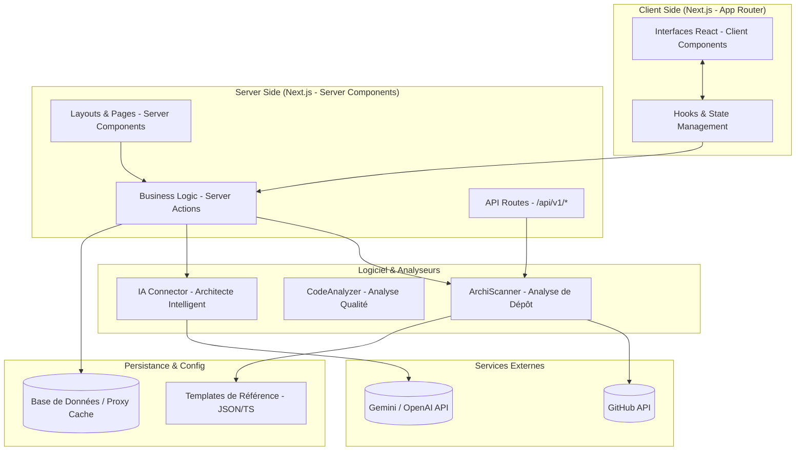

# Architecture Globale - Toolbox-IT

Ce document définit la structure technique de Toolbox-IT basée sur **Next.js**, les responsabilités de chaque module et les flux d'interactions.

## 🏗️ Schéma d'Architecture Globale (Next.js)

## 🧩 Responsabilités des Blocs

### 1. Frontend (Next.js Client Components)
- **Responsabilité** : Rendu dynamique, interactions temps réel (Chat IA), gestion des formulaires et affichage des scores.
- **Technologies** : React, Tailwind CSS, Framer Motion (Animations).

### 2. Backend & Server Actions (Next.js Server Side)
- **Responsabilité** : Sécurisation des appels API (GitHub, IA), orchestration des traitements asynchrones et accès aux données.
- **Technologies** : Next.js Server Actions, API Routes.

### 3. ArchiScanner & CodeAnalyzer (Logic)
- **Responsabilité** : Analyse technique des dépôts. Le `Scanner` parse l'arborescence GitHub et le `Linter` analyse la qualité du code.
- **Technologies** : TypeScript, Parser AST (optionnel).

### 4. IA Architecte (Service)
- **Responsabilité** : Dialogue avec les LLM pour générer des conseils d'architecture et des structures de projets.

### 5. Templates de Référence (Data)
- **Responsabilité** : Grilles de notation et exemples de structures (MVC, Clean Archi) pour chaque langage supporté.

## 🔄 Flux Principaux (Next.js Flow)

### Flux A : Analyse d'Architecture (Scan)
1. L'utilisateur saisit une URL GitHub côté Client.
2. Une **Server Action** est appelée, assurant que le token GitHub reste secret.
3. Le serveur exécute le `Scanner` qui interroge la `GitHub API`.
4. Le résultat est comparé aux `Templates` et renvoyé au Client pour affichage.

### Flux B : Conseil de l'IA Architecte
1. Session de chat interactive (Client Components).
2. Requêtes envoyées aux **API Routes** de Next.js.
3. Le serveur communique avec l'IA (`Gemini/OpenAI`).
4. Streaming de la réponse IA vers le client pour une expérience fluide.

## 🎓 Cohérence Next.js & Qualité
- **Performance** : Utilisation du Streaming et de Suspense pour afficher les rapports d'analyse progressivement.
- **Sécurité** : Protection CSRF native et isolation des secrets côté serveur.
- **Maintenabilité** : Structure par "features" à l'intérieur du répertoire `app/`, facilitant l'évolution du projet.
