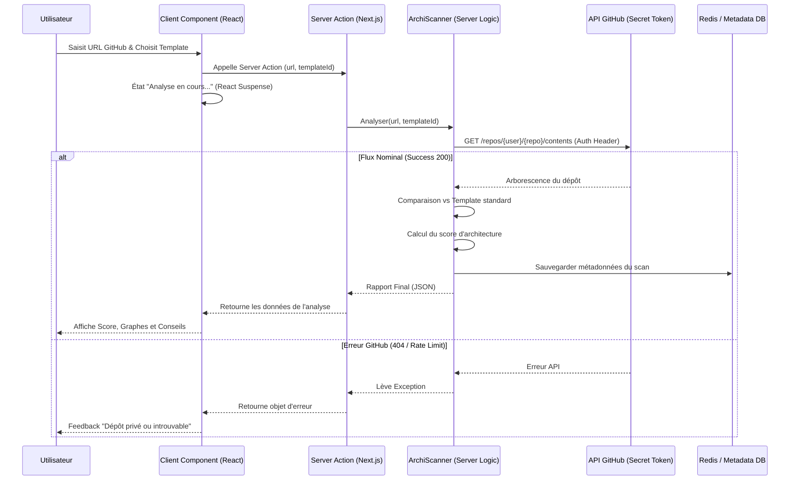

# Diagramme de Séquence : Parcours Principal - Toolbox-IT

Ce document modélise les interactions techniques lors du parcours principal sous **Next.js** : le scan d'une architecture GitHub par un utilisateur.

## 🔄 Analyse d'Architecture (Next.js & Server Actions)

## 📝 Détails des Étapes (Next.js Paradigm)

### 1. Sécurisation (Server-Side)
L'utilisation de **Server Actions** garantit que le `GITHUB_TOKEN` utilisé pour requêter les dépôts (et éviter le rate-limiting) n'est jamais exposé dans le code envoyé au navigateur de l'utilisateur.

### 2. Traitement des données
Le composant `ArchiScanner` s'exécute côté serveur. Il peut ainsi manipuler des structures complexes et effectuer la comparaison avec les templates stockés en base de données ou en fichiers statiques serveur sans impacter le poids du bundle client.

### 3. Persistance & Cache
Les résultats ne sont plus limités au `LocalStorage`. Ils peuvent être stockés dans une base de données (ex: Prisma + PostgreSQL) ou un cache rapide (Redis), permettant à un professeur de retrouver les scans de toute sa promotion de manière centralisée.

### 4. Expérience Utilisateur
Le passage à Next.js permet d'utiliser le **Streaming** : l'utilisateur voit l'interface de résultat immédiatement, et les détails de l'analyse "populent" l'écran au fur et à mesure que le serveur termine ses calculs.

---
*Diagramme mis à jour pour la stack Next.js le 14/04/2026.*
