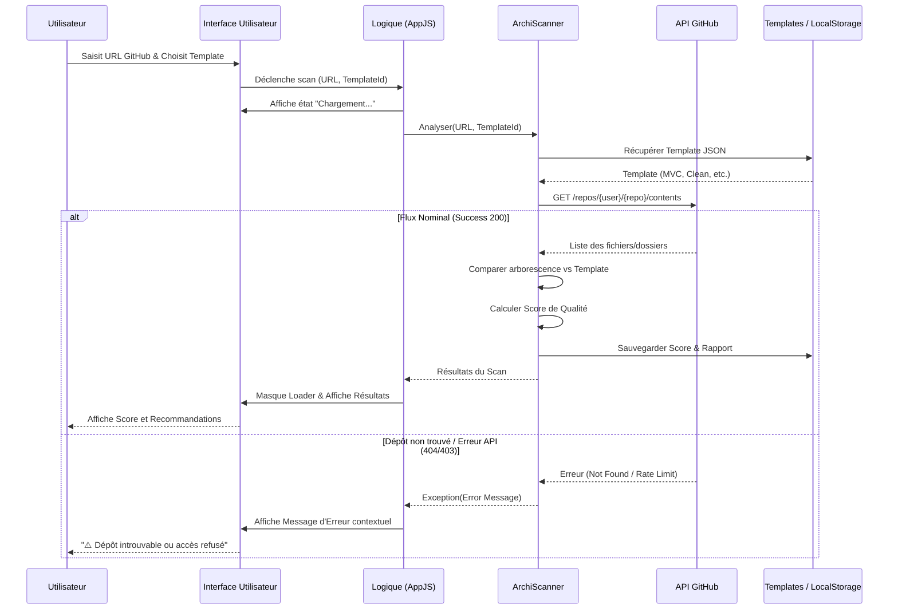

# Diagramme de Séquence : Parcours Principal - Toolbox-IT

Ce document modélise les interactions techniques lors du parcours principal : le scan d'une architecture GitHub par un utilisateur.

## 🔄 Analyse d'Architecture (Scan GitHub)

Le diagramme suivant illustre le flux nominal et un cas d'erreur (dépôt non trouvé).

## 📝 Détails des Étapes

### 1. Validation & Traitement
L'interface utilisateur effectue une première validation formatée de l'URL GitHub avant d'appeler la logique applicative. La logique (`AppJS`) orchestre ensuite les appels aux services spécialisés.

### 2. Récupération & Services Externes
Le composant `ArchiScanner` est responsable de la communication avec l'API GitHub. Il transforme la réponse brute de GitHub en une structure interne comparable à nos templates.

### 3. Persistance
Chaque scan réussi est persisté dans le `LocalStorage`. Cela permet à l'utilisateur de retrouver ses analyses précédentes sans re-scanner le dépôt (gain de temps et économie de quota API).

### 4. Gestion d'Erreur
Le diagramme prévoit le cas où le dépôt n'est pas accessible (privé, URL erronée) ou si les limites de l'API GitHub sont atteintes. L'utilisateur reçoit alors un feedback explicite au lieu d'un écran figé.

---
*Diagramme cohérent avec l'Architecture Globale (US10) et la Stack Technique (US11).*
