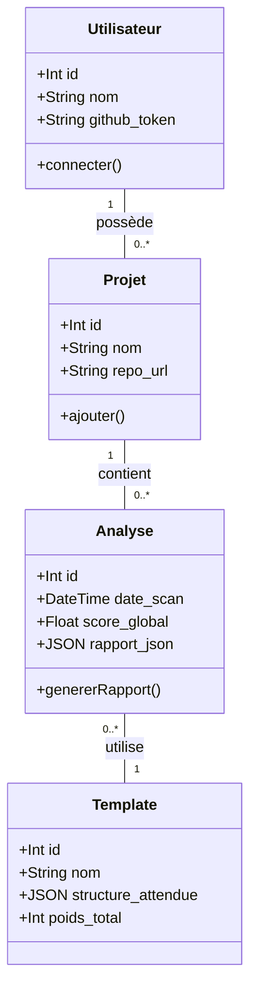

# Modèle Conceptuel et de Données - Toolbox-IT

Ce document décrit les entités métier, leurs relations et la structure des données de la plateforme Toolbox-IT pour répondre aux besoins du MVP.

## 📊 Diagramme de Classes (Domaine)

## 📋 Dictionnaire des Données

### Entité : Projet
| Champ | Type | Contraintes | Description |
| :--- | :--- | :--- | :--- |
| `id` | Integer | PK, Auto-increment | Identifiant unique du projet. |
| `nom` | String(100) | Not Null | Nom du projet (ex: "ChatViz"). |
| `repo_url` | String(255) | Not Null, Unique | URL complète du dépôt GitHub. |
| `utilisateur_id` | Integer | FK | Lien vers l'auteur. |

### Entité : Template
| Champ | Type | Contraintes | Description |
| :--- | :--- | :--- | :--- |
| `id` | Integer | PK, Auto-increment | Identifiant du template. |
| `nom` | String(50) | Not Null | Nom (ex: "MVC PHP", "Clean Node"). |
| `structure_ref` | JSON | Not Null | Arborescence attendue (Dossiers/Fichiers). |
| `poids_criteres` | JSON | Default {} | Importance relative de chaque dossier. |

### Entité : Analyse (Le Scan)
| Champ | Type | Contraintes | Description |
| :--- | :--- | :--- | :--- |
| `id` | Integer | PK | Identifiant de l'analyse. |
| `date_scan` | DateTime | Default NOW | Date et heure de l'exécution. |
| `score_global` | Float | Check (0-100) | Note finale calculée. |
| `rapport_détails` | JSON | Not Null | Liste des dossiers manquants/présents. |
| `projet_id` | Integer | FK | Projet analysé. |
| `template_id` | Integer | FK | Template de référence utilisé. |

## 📐 Règles métier & Validations
1. **Unicité des Repos** : Un même `repo_url` ne peut pas être ajouté deux fois pour le même utilisateur.
2. **Score de Cohérence** : Le `score_global` est la moyenne pondérée de la présence des dossiers clés définis dans le `Template`.
3. **Archivage** : Les `analyses` sont conservées historiquement pour permettre de voir la progression de l'étudiant entre deux scans.

---
*Base de données conçue pour être implémentée via un backend SQL ou simulée via un stockage JSON structuré.*
